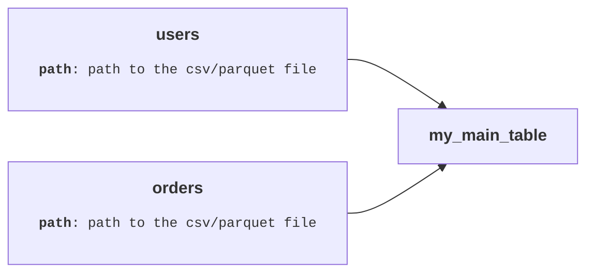

# deff

Define SQL data transformation graphs where ***each table is a Python function***. *We don't define a table, we* ***deff*** *it!*

A common way to think about data transformation is in terms of "pipelines", a linear chain of steps or stages flowing toward a single output. In this approach, we have a "primary" table, and one or more "secondary tables". **deff** sees it differently. There is no "primary" table. Instead, every table is a node in a graph (expressed as a Python function), and equally accessible.

```python
from deff import tbl

@tbl
def users(path='<path to the csv/parquet file>'):
    return f"FROM '{path}'"

@tbl
def orders(path='<path to the csv/parquet file>'):
    return f"FROM '{path}'"

@tbl
def my_main_table():
    return f"""
    FROM {orders} LEFT JOIN {users} on user_id = id
    SELECT user_id, user_name, avg(revenue) as avg_revenue
    GROUP BY ALL
    ORDER BY avg_revenue DESC
    """
```


In the above code, each decorated function is a table. The interesting part is what you can do with any of these tables naturally:

1. Calling `my_main_table()` materializes it immediately. deff resolves the full dependency graph starting from that node, topologically sorts everything, and executes the complete graph, no manual orchestration. The same works for any table in the graph:

```python
my_main_table()          # materializes my_main_table (and its dependencies)
orders()                 # materializes just the orders table
users()                  # materializes just the users table
```

2. You can also visualize where a table comes from. Calling `.graph` on any table prints a Mermaid diagram showing its full dependency chain:

```python
my_main_table.graph  # shorthand for my_main_table().graph when the function has no args (implicit call)
```



The dependency structure is automatic. You never write `depends_on`, `ref()`, or any explicit wiring. The Python function structure *is* the DAG, what you see is what the graph looks like.

3. Tables are functions, so obviously they can be **parameterized**. The same transformation can produce different tables by varying its arguments:

```python
@tbl
def users_by_age(age=18):
    return f"""--sql
    FROM '{path}'
    WHERE age = {age}
    """

@tbl
def my_main_table():
    users_age_20 = users_by_age(age=20)  # filter only users whose age are 20

    # The below query filter the users whose age are 18 or 20
    return f"""
    FROM {users_by_age}
    UNION BY NAME
    FROM {users_age_20}
    """
```

This makes your tables highly reusable and flexible, you can even import tables/functions in one project to use in another if they're generic enough.


## Install

```bash
pip install deff
```


## Examples

- [`examples/jaffle_shop.py`](examples/jaffle_shop.py).
